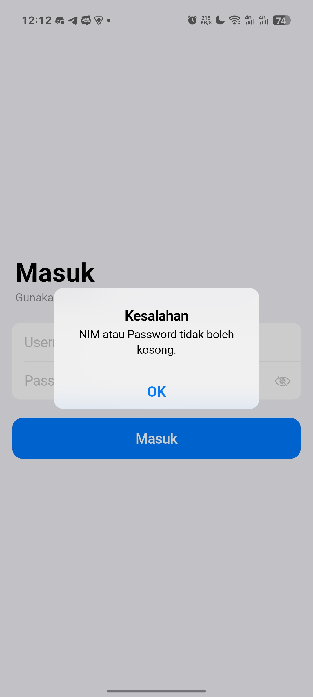
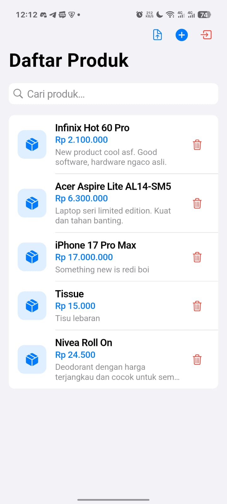
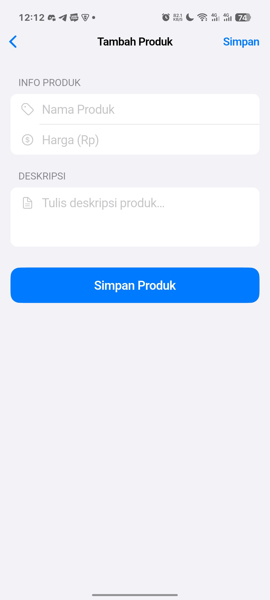
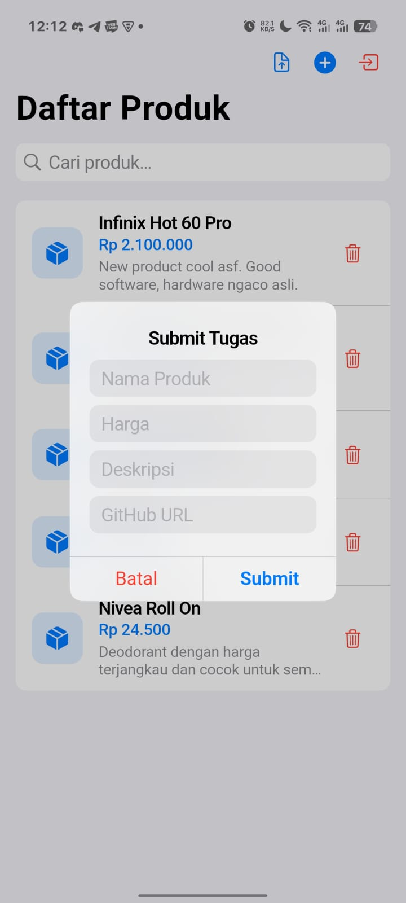
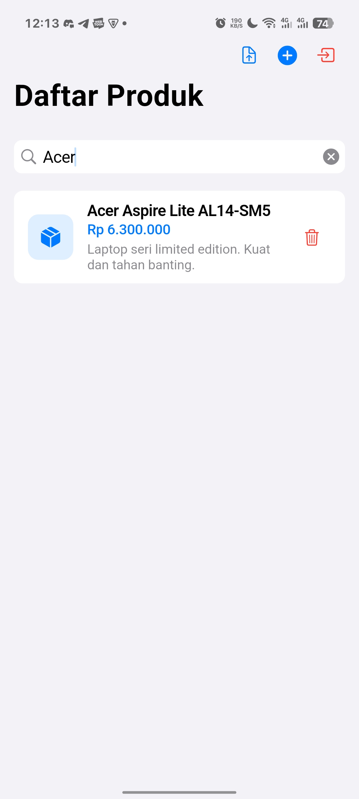

# PrcTaskOne — Product Management

**Mobile Development Course Assignment — API Integration & CRUD**

---

## About The Project

This repository contains a Flutter application that implements a product management system with user authentication. The app communicates with a REST API to perform full CRUD operations on product data.

This project was developed as part of a university assignment for the **Mobile Development (PBM)** course. The primary objective is to practice and demonstrate proficiency in API integration, secure token-based authentication, and building functional mobile interfaces.

### Objectives

* Implement user authentication flow with secure token storage.
* Perform CRUD operations (Create, Read, Delete) against a remote REST API.
* Apply Apple Human Interface Guidelines (HIG) design principles using Flutter's Cupertino widget library.
* Demonstrate modular architecture by separating models, services, screens, widgets, and themes.

---

## UI Design Implementation

The application UI follows Apple HIG conventions using Cupertino widgets for a native iOS look and feel. Screenshots of the implemented screens:

<br>

<table align="center" style="border-collapse: collapse; border: none;">
  <tr>
    <td align="center" style="border: none;">
      <br/><br/>
      <b>Login</b>
    </td>
    <td align="center" style="border: none;">
      <br/><br/>
      <b>Product List</b>
    </td>
    <td align="center" style="border: none;">
      <br/><br/>
      <b>Add Product</b>
    </td>
  </tr>
  <tr>
    <td align="center" style="border: none;">
      <br/><br/>
      <b>Submit Task</b>
    </td>
    <td align="center" style="border: none;">
      <br/><br/>
      <b>Search & Filter</b>
    </td>
    <td align="center" style="border: none;">
      <br/><br/>
      <b>Confirmation</b>
    </td>
  </tr>
</table>

<br>

---

## Technical Highlights

The application structure follows Flutter best practices for maintainability and readability:

* **Authentication**: Token-based login with secure local storage via `flutter_secure_storage`.
* **API Integration**: Full REST client using the `http` package with proper error handling.
* **Cupertino Design**: Built entirely with `CupertinoApp`, `CupertinoPageScaffold`, `CupertinoSliverNavigationBar`, and other native iOS widgets.
* **Modularization**:
  * `lib/models/` — Data models (`ProductModel`, `ProductRequestModel`, `SubmitTugasModel`).
  * `lib/services/` — API service layer handling all network requests.
  * `lib/screens/` — Screen-level widgets (`LoginScreen`, `ProductListScreen`, `AddProductScreen`).
  * `lib/widgets/` — Reusable components (`ProductCardWidget`).
  * `lib/theme/` — Centralized design tokens (colors, typography, spacing, radii).

## Getting Started

### Prerequisites

* Flutter SDK (Version `^3.10.7` or higher)
* Dart SDK

### Installation

1. Clone the repository:
   ```sh
   git clone <repository-url>
   ```
2. Navigate to the project directory:
   ```sh
   cd prctaskone
   ```
3. Install dependencies:
   ```sh
   flutter pub get
   ```
4. Run the application:
   ```sh
   flutter run
   ```

## Dependencies

| Package | Purpose |
|---|---|
| [`http`](https://pub.dev/packages/http) | REST API networking |
| [`flutter_secure_storage`](https://pub.dev/packages/flutter_secure_storage) | Secure token persistence |
| [`cupertino_icons`](https://pub.dev/packages/cupertino_icons) | iOS-style iconography |

## Development Environment

* **Framework**: [Flutter](https://flutter.dev/)
* **Language**: Dart
* **Target Platforms**: Android, iOS (Cross-platform)